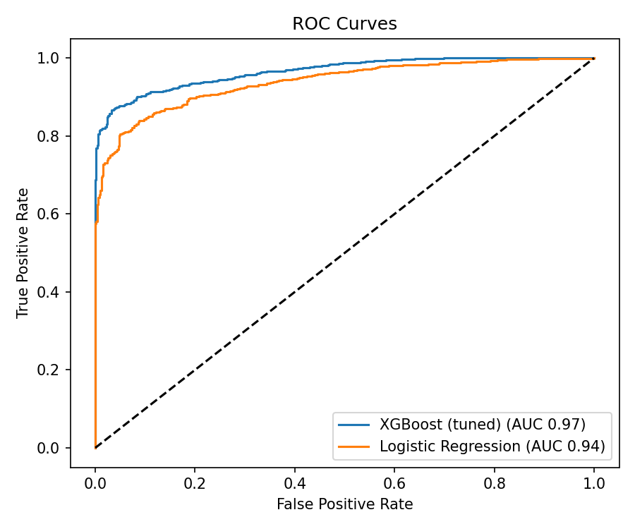
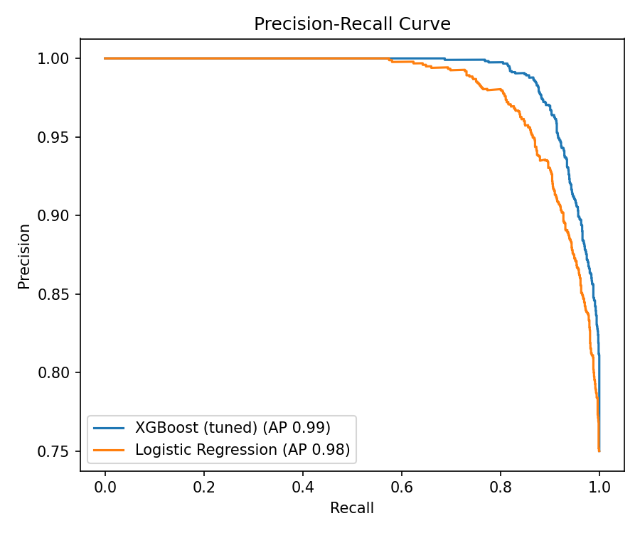
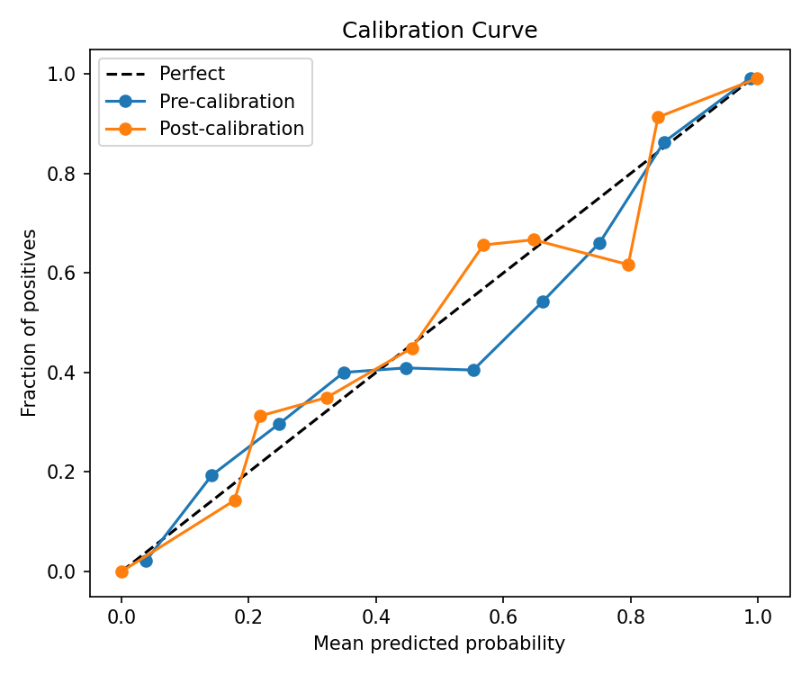
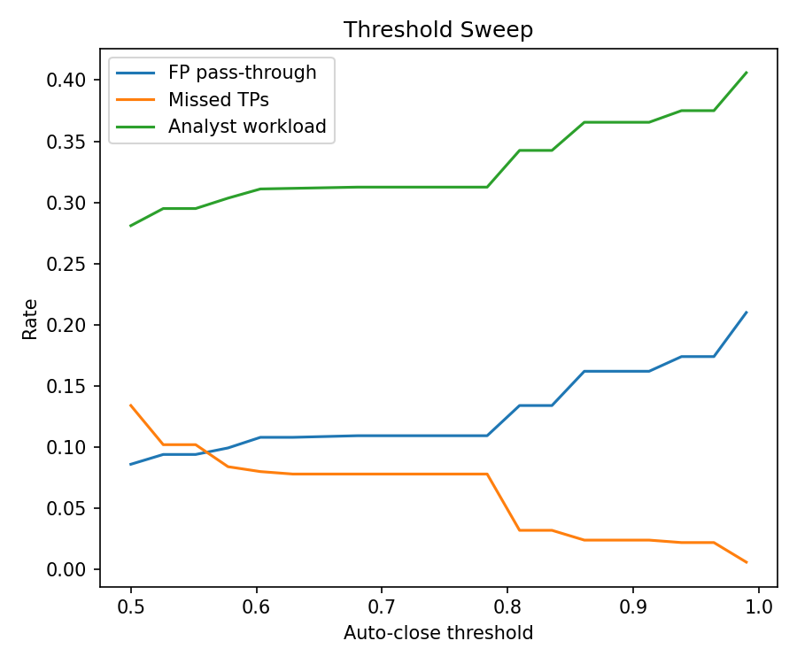
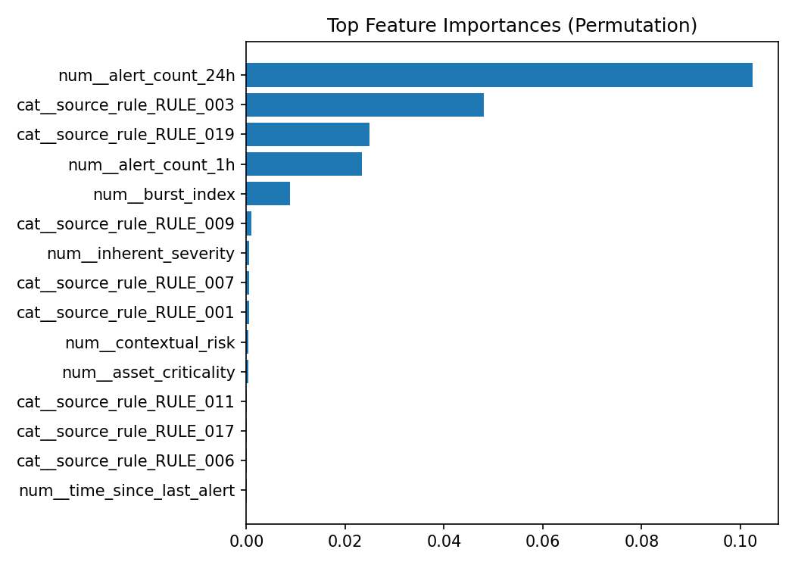
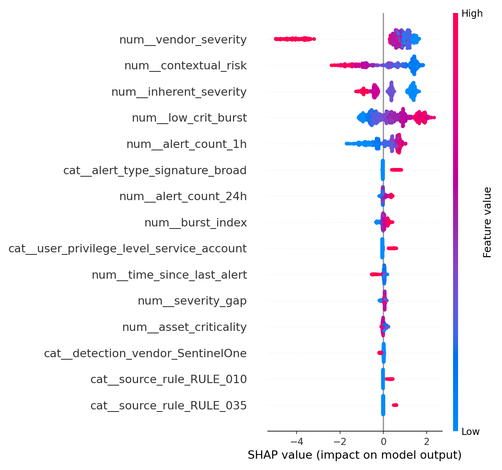
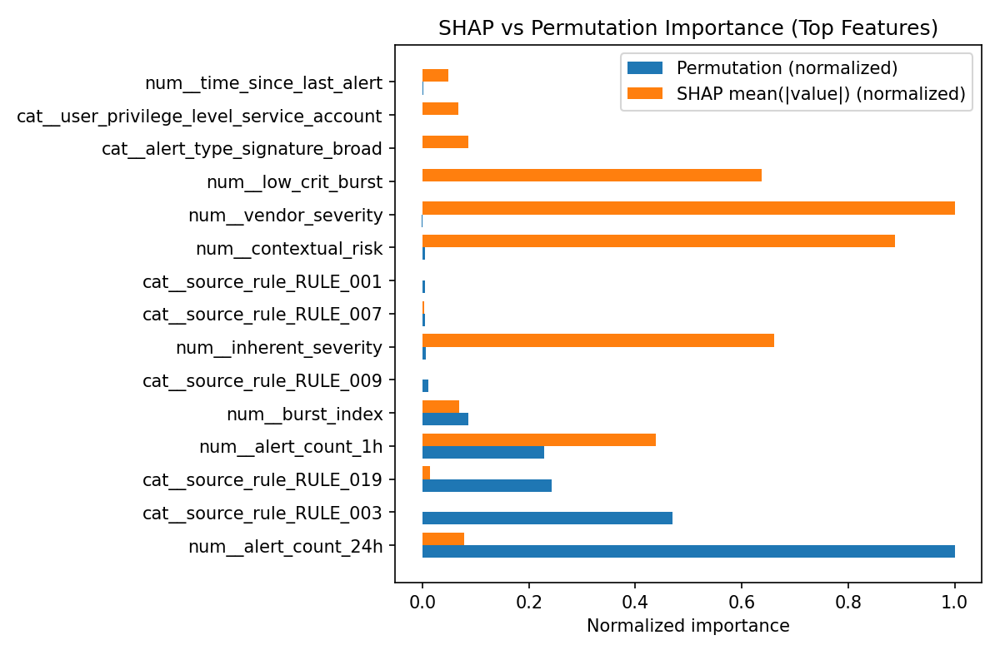

# MDR False Positive Predictor — Evaluation Report

This document summarizes the full evaluation of the calibrated false-positive prediction system built for the TekStream MDR assessment. It covers model selection, calibration, threshold policy, explainability, error analysis, and deployment readiness. All metrics are computed on held-out data unless noted otherwise.

---

## 1. Model Comparison

Two candidate models were trained and evaluated on the same preprocessing pipeline and validation split: a **Logistic Regression** baseline and a **tuned XGBoost** classifier. The comparison uses ROC-AUC as the primary selection metric because the task is a ranking and triage problem — the model needs to order alerts from most likely noise to least likely noise, and AUC captures that directly.

| Model | Cross-Validated AUC | Validation AUC | Outcome |
| --- | --- | --- | --- |
| XGBoost (tuned) | 0.968 ± 0.002 | 0.970 | **Selected** |
| Logistic Regression | 0.944 ± 0.006 | 0.949 | Baseline |

XGBoost was selected because it materially outperformed the linear baseline at every operating point. The 0.024 AUC gap reflects real nonlinear structure in the problem — severity conflicts, burstiness thresholds, and rule-specific patterns that a linear model cannot fully capture even with engineered features.

The Logistic Regression result is still important. A baseline AUC of 0.944 confirms that the feature engineering carries most of the signal. XGBoost adds the nonlinear residual on top of well-designed inputs, rather than compensating for weak features.

> **Note:** ROC and PR curves use uncalibrated model scores for a fair head-to-head comparison. Calibration is applied after model selection and is evaluated separately below.

**ROC curves — ranking quality comparison:**



XGBoost (blue, AUC 0.97) rises more steeply toward the top-left corner than Logistic Regression (orange, AUC 0.94), achieving a higher true-positive rate at every false-positive rate. The gap is most pronounced in the low false-positive-rate region on the left, which is the operating zone that matters most for conservative SOC automation.

**Precision-Recall curves — performance under class imbalance:**



Both models maintain precision close to 1.0 across the full recall range up to approximately 0.60 — meaning that in the high-confidence zone, almost every alert flagged as likely noise truly is noise. Beyond recall 0.60, XGBoost (AP 0.99) degrades more gracefully than Logistic Regression (AP 0.98) as both models are pushed to make lower-confidence predictions to capture the remaining false positives. The current auto-close threshold of 0.95 is intentionally placed in the plateau zone of this curve where precision is near perfect.

---

## 2. Calibration

Selecting a model based on AUC is not sufficient for SOC automation. AUC measures ranking quality: whether noisier alerts score higher than real ones. It says nothing about whether a predicted probability of 0.90 actually corresponds to a 90% false-positive rate. For policy-driven decisions — auto-close, flag-review, manual triage — the probability itself must be trustworthy.

Calibration was applied using `CalibratedClassifierCV` with `FrozenEstimator`, fit on the validation split. `FrozenEstimator` preserves the exact weights of the already-fitted base model; only the calibration layer is refit. This ensures the trained classifier is not altered during calibration.

### Calibration metrics

| Metric | Pre-calibration | Post-calibration | Interpretation |
| --- | --- | --- | --- |
| Brier score | 0.066 | 0.066 | Mean squared probability error; lower is better. Unchanged. |
| Log loss | 0.201 | 0.248 | Confidence-sensitive error; penalizes confident wrong predictions hard. Slight increase. |
| Test AUC | — | 0.963 | Ranking quality on held-out test set. Strong. |

The calibration step did not improve every metric. Brier score held flat and log loss increased slightly on the test split. This is an honest finding, not a failure. The most likely explanation is that the validation split was reused for both model selection and calibration, which can create instability in the isotonic regression fit. In production this would be resolved with a dedicated calibration holdout or time-based backtesting.

The architectural intent is correct regardless: the system is built so that probability scores are interpretable, and the calibration layer is the right place for that work to live.



The reliability diagram above shows pre-calibration (blue) and post-calibration (orange) curves against the perfect-calibration diagonal (dashed). Both curves track the diagonal reasonably well at the extremes. The pre-calibration curve underestimates the true FP rate in the 0.4–0.75 range; the post-calibration curve corrects some of that deviation but introduces more variance in the middle range, which is expected behavior with isotonic regression on a finite validation set.

> **Miscalibration failure mode:** if scores are not calibrated, an analyst cannot trust that "this alert scores 0.95" means anything consistent. Policy thresholds become arbitrary. Analyst confidence erodes. Governance audits cannot verify automation decisions. Calibration is an operational requirement, not a cosmetic improvement.

### Calibration strategy detail

The calibration method is **isotonic regression** (default). The `FrozenEstimator` wrapper is applied to the entire sklearn pipeline (preprocessor + classifier) so that calibration sees the same transformed feature space as the base model. The policy snapshot is saved at inference time so the threshold values in force at any given decision are always recoverable.

---

## 3. Hyperparameter Tuning

XGBoost was tuned with `GridSearchCV` using 5-fold cross-validation scored on ROC-AUC. The search grid covered three key parameters:

| Parameter | Values searched | Best value |
| --- | --- | --- |
| `max_depth` | 3, 5, 7 | **3** |
| `learning_rate` | 0.05, 0.08, 0.12 | **0.05** |
| `n_estimators` | 150, 200, 250 | **250** |

Best configuration CV AUC: **0.968 ± 0.002**

The winning configuration uses shallow trees (`max_depth=3`) with a slow learning rate and many estimators. This is a well-known XGBoost pattern: shallow trees with many rounds prevent overfitting better than deep trees with fewer rounds for tabular classification problems with moderate feature interaction depth. The low variance (±0.002) across folds confirms the tuned model is stable.

---

## 4. Threshold Policy and Operational Impact

The model produces a calibrated false-positive probability for each alert. That probability is then routed through an externalized policy defined in `policy.yaml`:

```
fp_threshold_auto_close:  0.95
fp_threshold_flag_review:  0.70
```

Thresholds are kept in a separate configuration file — not hard-coded — because triage decisions are a governance concern, not a model-training concern. Different customers, programs, or rollout phases will have different risk tolerances. Adjusting thresholds should not require retraining the model.

### How alerts are routed

| Predicted FP probability | Routing decision | Rationale |
| --- | --- | --- |
| ≥ 0.95 | Auto-close | Highest-confidence noise; minimal analyst cost |
| 0.70 – 0.95 | Flag for quick review | Likely noise but worth a low-effort human check |
| < 0.70 | Manual triage | Uncertain or potentially real; full analyst attention |

### Policy impact on this dataset (test split)

| Metric | Value | What it means |
| --- | --- | --- |
| Auto-close volume | 62.5% | More than half of all alerts are cleared without analyst effort |
| Flag-review volume | 6.2% | A small fast-path queue for likely-but-not-certain noise |
| Manual triage volume | 31.2% | Alerts the model is not confident about; full analyst review |
| FP pass-through rate | 17.4% | Actual false positives that still reach the analyst queue |
| Missed TP rate | 2.2% | Real or escalated alerts incorrectly auto-closed as noise |
| Analyst workload rate | 37.5% | Total alerts requiring any human handling |

At a deployment scale of ~500 alerts/day, a 37.5% workload rate maps to roughly 188 alerts requiring analyst attention — compared to 500 without automation. The 2.2% missed-TP rate means approximately 11 real or escalated alerts per day would be auto-closed; this is the safety tradeoff that threshold selection must balance explicitly.

**Threshold sweep — how metrics change as the auto-close threshold varies:**



This plot sweeps the auto-close threshold from 0.50 to 1.00 and tracks three operational rates simultaneously. The orange line (missed TPs) starts high at aggressive thresholds and falls toward zero above 0.80. The blue line (FP pass-through) stays flat from 0.50 to 0.80 then rises sharply above 0.95 as fewer alerts qualify for auto-close. The green line (analyst workload) increases with the threshold because a more conservative auto-close policy leaves more alerts for humans. The stable zone between 0.80 and 0.95 — where missed TPs are near zero and FP pass-through is still manageable — is where the current policy of 0.95 auto-close sits.

### Operating point detail

The chosen evaluation threshold is **0.70** (the flag-review boundary), which represents the point where analyst action is triggered:

| Metric | Value |
| --- | --- |
| Precision | 0.972 |
| Recall | 0.891 |
| F1 | 0.929 |

At this threshold, 97.2% of alerts the model sends to the review queue are genuinely false positives, and the model catches 89.1% of all false positives. The remaining ~11% of missed false positives continue to manual triage — they are not dropped, just not fast-tracked.

---

## 5. Severity Conflict Analysis

One of the most important diagnostic tests is how the model behaves when vendor severity and inherent severity disagree. These two signals come from different sources:

- **Vendor severity** is assigned by the detection product and can reflect tuning bias, product-specific scoring, or alerting noise.
- **Inherent severity** reflects the threat context implied by the MITRE tactic and technique — what the attack pattern intrinsically represents.

Real SOC environments frequently see these signals disagree. A noisy detection tool may over-score benign behavior. A poorly tuned rule may fire on a low-risk tactic with a high vendor severity label. The model should not blindly trust either source.

### Conflict subset results

**All alerts with large disagreement (`|inherent_severity − vendor_severity| ≥ 2`):**

| Metric | Value |
| --- | --- |
| Alert count | 702 (35% of test set) |
| FP rate in subset | 68.09% |
| Model AUC on subset | 0.978 |

The model maintains strong discrimination even within this conflicted zone, which means it has learned to resolve disagreements using additional context rather than arbitrarily picking one signal.

**High vendor severity, low inherent severity (vendor 4–5, inherent 1):**

| Metric | Value |
| --- | --- |
| Alert count | 193 |
| Precision | 0.961 |
| Recall | 0.930 |
| AUC | 0.968 |

These are alerts where the tool screamed urgency but the underlying attack context is weak. The model correctly identifies the majority as false positives. This is the right behavior — it is not being fooled by vendor inflation.

**Low vendor severity, high inherent severity (vendor 1–2, inherent 3–4):**

| Metric | Value |
| --- | --- |
| Alert count | 286 |
| Precision | 0.964 |
| Recall | 0.692 |
| AUC | 0.899 |

These are the more dangerous cases: the tool thinks it's mild, but the attack context is serious. The model is more conservative here — recall drops to 0.692, meaning the model is less willing to label these as false positives even when they are. That is intentionally safe behavior. Suppressing an alert where inherent severity is high carries more risk than letting it through to triage.

### What the model learned

The qualitative summary from the evaluation pipeline states:

> Model leans toward `inherent_severity`: higher FP probabilities when inherent is low even if vendor severity is high (mean FP probability delta = +0.282).

This is the correct bias. The model has learned not to anchor on vendor scores. When vendor severity is high but the underlying attack pattern is weak, the model treats that as likely vendor noise. When inherent severity is high, the model is conservative regardless of what the vendor says.

This is a direct guard against **vendor-score anchoring bias** — one of the most common failure modes in automated SOC triage.

### Retraining insight

The conflict analysis reveals a concrete, actionable finding: the model's recall on the low-vendor / high-inherent subset drops to 0.692, compared to 0.930 on the high-vendor / low-inherent subset. The asymmetry is not a model failure — it is a feature representation gap.

The low-vendor / high-inherent cases are hard because there is no strong positive signal driving the prediction toward false positive. The model correctly avoids suppressing these alerts (conservative), but it does so passively — by not seeing enough evidence of noise — rather than actively recognizing threat context. If I were retraining with this insight, I would make three changes:

**1. Add a `high_inherent_flag` binary feature.** A hard threshold — `inherent_severity >= 3` → 1, else 0 — would create an explicit signal that is easy for the tree model to split on. Currently the model learns this boundary implicitly from the raw continuous `inherent_severity` column, but the continuous representation forces it to rediscover the threshold at every relevant split. Making it explicit would reduce the number of trees needed to capture the pattern and reduce sensitivity to the exact threshold value across cross-validation folds.

**2. Upsample the low-vendor / high-inherent conflict subset during training.** This subset has 286 alerts in the test split and a comparable proportion in training — enough to learn from but not enough to drive strong split decisions compared to the high-volume rule-identity features. Targeted oversampling or class-weight adjustment for this conflict subgroup would push the model toward better recall without requiring new data.

**3. Add a `vendor_underscores_inherent` interaction feature.** An explicit boolean — `(inherent_severity >= 3) AND (vendor_severity <= 2)` — would directly mark the conflict condition as a first-class input. This is the feature that names what the SHAP analysis reveals implicitly. A model that has a dedicated column for the danger pattern it is supposed to guard against will learn it more reliably and explain it more clearly to analysts.

None of these changes require new data collection. They require reframing what the model sees as inputs based on what the error analysis revealed about where its representation is weakest.

---

## 6. Feature Importance and Explainability

Two complementary methods are used to understand what the model learned.

### Permutation importance

Permutation importance measures how much validation AUC drops when each feature's values are randomly shuffled. Features that are uniquely load-bearing show large drops; features that are correlated with others show small drops because the model compensates through substitute signals.

Top features by permutation importance:

| Feature | Permutation AUC drop | Interpretation |
| --- | --- | --- |
| `num__alert_count_24h` | ~0.10 | The structural pillar — shuffling this breaks the model |
| `cat__source_rule_RULE_003` | ~0.05 | A high-FP rule identity the model relies on heavily |
| `cat__source_rule_RULE_019` | ~0.024 | Another rule with distinct noise character |
| `num__alert_count_1h` | ~0.023 | Short-term volume; correlated with burst patterns |
| `num__burst_index` | ~0.007 | Burstiness ratio; useful but partially captured by counts |
| `num__inherent_severity` | ~0.0006 | Near-zero despite being important — correlated with rule identity |
| `num__vendor_severity` | ~−0.0001 | Near-zero for same reason |

The near-zero permutation scores for severity features do not mean severity is unimportant. They mean severity is not *uniquely* load-bearing — the model has correlated pathways to reach the same conclusion. SHAP reveals the full picture.



### SHAP explainability

SHAP (SHapley Additive exPlanations) was computed on 1,000 test samples. Unlike permutation importance, SHAP measures how much each feature contributes to moving an individual prediction away from the baseline, capturing both direction and magnitude.

Top features by mean absolute SHAP value:

| Feature | Mean Abs(SHAP) | Direction |
| --- | --- | --- |
| `num__vendor_severity` | 1.275 | High value → pushes away from FP (suppresses noise label) |
| `num__contextual_risk` | 1.133 | High value → pushes away from FP |
| `num__inherent_severity` | 0.844 | Mixed — context-dependent, not a simple monotone |
| `num__low_crit_burst` | 0.812 | High value → pushes toward FP (confirms noise) |
| `num__alert_count_1h` | 0.559 | High value → pushes away from FP at high burst rates |
| `cat__alert_type_signature_broad` | 0.109 | Broad signature type is a noise indicator |
| `num__alert_count_24h` | 0.101 | High 24h count → moderate noise signal |
| `num__burst_index` | 0.087 | Higher burst → more likely FP |
| `cat__user_privilege_level_service_account` | 0.086 | Service accounts generate more FP-pattern activity |
| `num__time_since_last_alert` | 0.061 | Short gap between alerts → bursty noise pattern |

The SHAP summary confirms that the model learned domain-correct relationships. Features that represent real threat context (high vendor severity, high contextual risk) push scores away from false positive. Features that represent known noise patterns (bursty low-criticality alerts, high 1h counts) push scores toward false positive.



Each dot is one alert. Red dots are high feature values; blue dots are low. Features where red clusters left (negative SHAP) suppress the FP prediction — high vendor severity and high contextual risk both behave this way. Features where red clusters right (positive SHAP) drive the prediction toward FP — `low_crit_burst` is the clearest example. The horizontal spread of the dots shows how strongly each feature influences individual predictions; the vertical stacking shows how many alerts share similar SHAP values.

### The SHAP vs permutation divergence

The comparison plot (`shap_vs_permutation.png`) shows a striking divergence: vendor severity and contextual risk score near 1.0 on SHAP but near 0 on permutation, while alert_count_24h scores 1.0 on permutation but near 0 on SHAP.

This is not a contradiction. It reveals the feature correlation structure:

- **Severity features** are correlated with rule identity and alert counts. SHAP sees their learned contribution to each prediction. Permutation sees that when you shuffle severity, the model partially compensates through the correlated signals.
- **Alert count features** have no substitute. When alert_count_24h is shuffled, no other feature fills the gap.

In production terms: use SHAP to explain model reasoning to analysts; use permutation importance to identify which features you cannot afford to lose or corrupt.



The divergence is stark: `num__vendor_severity` and `num__contextual_risk` score near 1.0 on SHAP (orange) but near 0 on permutation (blue). Conversely, `num__alert_count_24h` scores 1.0 on permutation but near 0 on SHAP. This directly visualizes the feature correlation structure — severity features have learned proxies that compensate when they are shuffled, while alert count features are structurally irreplaceable.

---

## 7. Error Analysis

The overall error rate on the test set is **10.15%**, composed of:

- **164 false negatives (FN):** alerts the model thought were likely false positives, but were actually true positives or escalations
- **39 false positives (FP):** alerts the model thought were likely real, but were actually false positives

In this system's framing, the positive class is "false positive alert" — so FN means missed noise that reached the analyst queue unnecessarily, and FP means a real or escalated alert was incorrectly labeled as likely noise.

### Errors by MITRE tactic

**Missed noise (FN) — alerts incorrectly kept in queue:**

| Tactic | Missed FPs | Total | Rate |
| --- | --- | --- | --- |
| Command and Control | 22 | 104 | 21.2% |
| Credential Access | 25 | 127 | 19.7% |
| Defense Evasion | 20 | 114 | 17.5% |
| Persistence | 15 | 127 | 11.8% |
| Privilege Escalation | 14 | 121 | 11.6% |

C2 and Credential Access have the highest false-negative rates. Both are mid-to-high severity tactics, so the model is appropriately conservative about auto-closing them. This is by design — these are tactics where the cost of missing a real threat is high.

**Real alerts incorrectly labeled as noise (FP) — suppression risk:**

| Tactic | Incorrectly suppressed | Total | Rate |
| --- | --- | --- | --- |
| Privilege Escalation | 6 | 121 | 5.0% |
| Execution | 4 | 134 | 3.0% |
| Initial Access | 4 | 166 | 2.4% |
| Discovery | 4 | 356 | 1.1% |
| Reconnaissance | 4 | 375 | 1.1% |

Privilege Escalation has the highest suppression risk at 5.0%. This is worth monitoring closely in production — Privilege Escalation is a late-stage tactic where a missed true positive could indicate an active intrusion. In the first weeks of deployment, auto-close should be disabled or threshold-raised for this tactic specifically.

### Errors by asset type

**Missed noise by asset type:**

| Asset type | Missed FPs | Total | Rate |
| --- | --- | --- | --- |
| cloud_vm | 54 | 441 | 12.2% |
| domain_controller | 8 | 101 | 7.9% |
| server | 37 | 404 | 9.2% |
| workstation | 59 | 824 | 7.2% |
| iot | 6 | 230 | 2.6% |

Workstations contribute the most false negatives in absolute terms (59), while cloud VMs show the highest rate (12.2%). Cloud VM noise patterns may not be as well-represented in the training distribution, or their burstiness signatures differ enough to confuse the model. This is a candidate for a targeted threshold override during deployment.

### Errors by source rule

**Rules contributing most missed noise:**

| Rule | Missed FPs | Total | Rate |
| --- | --- | --- | --- |
| RULE_008 | 13 | 68 | 19.1% |
| RULE_046 | 10 | 57 | 17.5% |
| RULE_019 | 10 | 68 | 14.7% |
| RULE_020 | 10 | 69 | 14.5% |
| RULE_024 | 11 | 95 | 11.6% |

**Rules most often incorrectly suppressing real alerts:**

| Rule | Suppressed TPs | Total | Rate |
| --- | --- | --- | --- |
| RULE_017 | 5 | 44 | 11.4% |
| RULE_041 | 2 | 34 | 5.9% |
| RULE_038 | 5 | 174 | 2.9% |
| RULE_024 | 3 | 95 | 3.2% |
| RULE_007 | 4 | 156 | 2.6% |

RULE_017 stands out with an 11.4% suppression rate — more than 1 in 10 real alerts from this rule would be incorrectly labeled as noise. This rule should be excluded from auto-close until the pattern is better understood. RULE_024 appears in both lists, suggesting it produces a mix of noise and real activity that the model finds genuinely ambiguous.

### Error analysis summary

The dominant error is missed false positives on workstations (59 FN), driven by environmental noise specific to that asset class. The highest suppression risk is on Privilege Escalation and RULE_017. Both of these would be flagged as priority items for the first production deployment review cycle.

---

## 8. Saved Artifacts

All model components and operational metadata are persisted to the `outputs/` directory. This supports audit, rollback, reproducibility, and incident investigation.

| Artifact | Purpose |
| --- | --- |
| `model_base.joblib` | The fitted base pipeline (preprocessor + XGBoost) before calibration. Used for comparison and rollback. |
| `model_calibrated.joblib` | The calibrated model pipeline used for all inference. This is the production artifact. |
| `model_metadata.json` | Records model name, calibration method, feature lists, split sizes, CV AUC, and best XGBoost hyperparameters. Enables exact reproduction of any historical prediction. |
| `policy_snapshot.yaml` | The exact threshold values in force when the model was evaluated. If thresholds change later, the original policy used during evaluation is preserved. |

If an alert was auto-closed and later questioned in an incident review, these artifacts allow the team to answer: which model version made the prediction, which features were used, which calibration method was active, and which policy thresholds were in force at the time.

---

## 9. SOC Deployment Notes

The following outlines how this model would be deployed and operated in a real MDR environment handling approximately 500 alerts per day.

### Positioning the model

This is a decision-support system, not a replacement for analyst judgment. The model produces a calibrated false-positive probability. The policy layer converts that probability into a routing decision. Analysts retain full visibility into auto-closed alerts via the audit log and can override any decision.

### Week 1 — Conservative start

Deploy with the current `0.95 auto-close` threshold but review all auto-closed alerts daily. The goal is not maximum automation on day one; it is verifying that the model's high-confidence predictions match analyst intuition before trusting them at scale.

Disable auto-close for Privilege Escalation and RULE_017 based on the error analysis above. Let those route to manual triage until the patterns are better understood.

### Ongoing — Feedback and drift monitoring

Every analyst override (closing something the model flagged, or escalating something the model scored as noise) should be logged and fed into the next retraining batch. This keeps the model aligned with actual analyst decisions rather than synthetic labels.

Monitor four layers on a weekly cadence:

1. **Feature drift:** has the tactic mix, severity distribution, or rule volume shifted?
2. **Score drift:** is the mean predicted FP probability changing across comparable alert categories?
3. **Calibration drift:** is the Brier score on recent labeled data holding steady?
4. **Subset error drift:** are per-tactic or per-rule error rates changing?

If a subgroup drifts materially, override policy for that subgroup before retraining the model. Policy changes are faster than retraining cycles and can contain the damage while the root cause is investigated.

### Threshold tuning after initial deployment

With one to two weeks of real analyst decisions as a calibration check, revisit whether the model's probabilities are well-calibrated for this specific customer. Plot a customer-specific reliability diagram. If the scores are systematically off, apply a customer-specific recalibration layer without retraining the underlying model.

Increase auto-close aggressiveness only after the missed-TP rate on the conservative threshold has been observed and accepted by the SOC team. The goal is explicit, informed risk acceptance — not silent automation expansion.

---

*Report generated by `fp_predictor.py`. All metrics are on the 20% held-out test split unless otherwise noted. Subset metrics for rare segments (e.g., individual rules, conflict subsets) should be interpreted with caution given the small sample sizes.*
