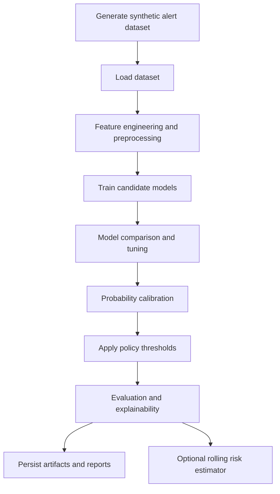
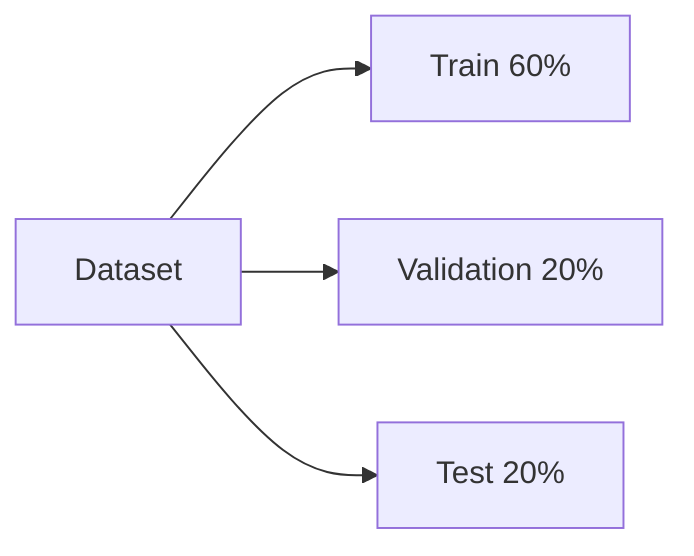
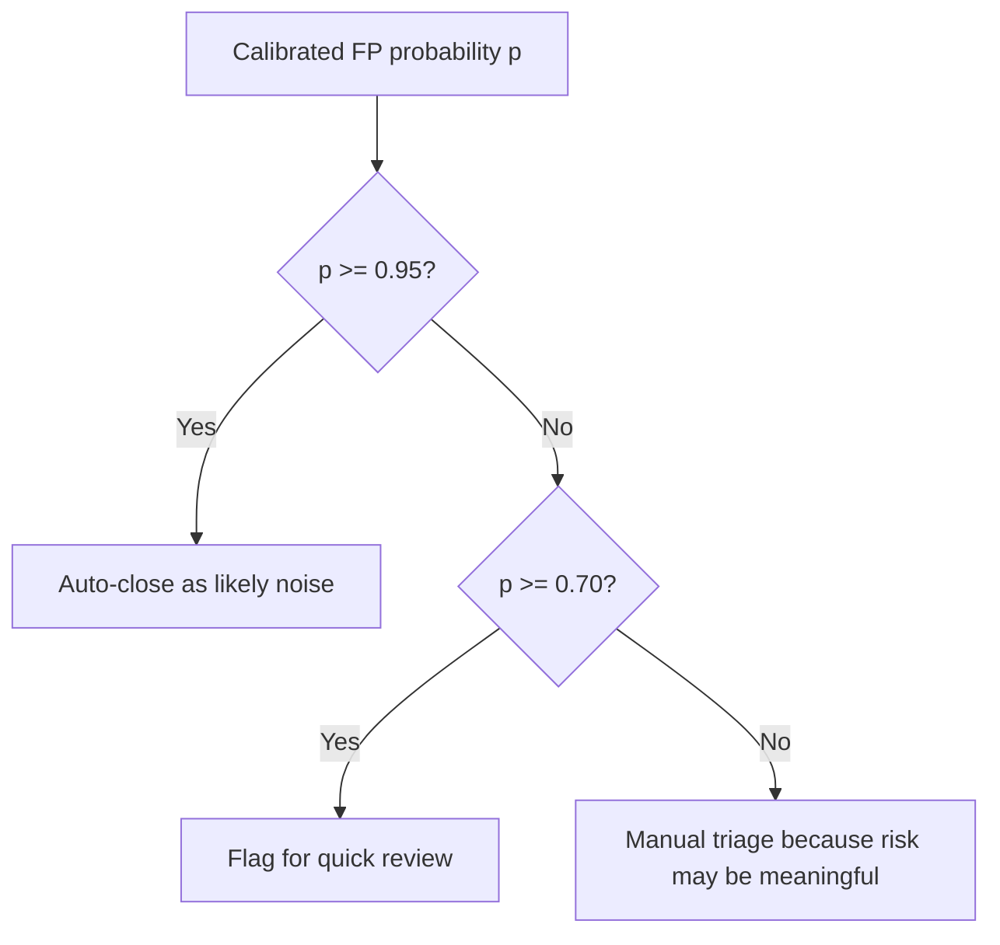
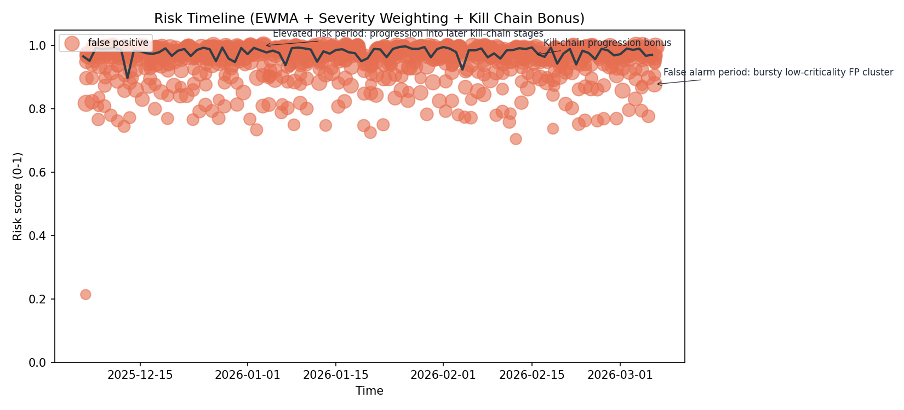
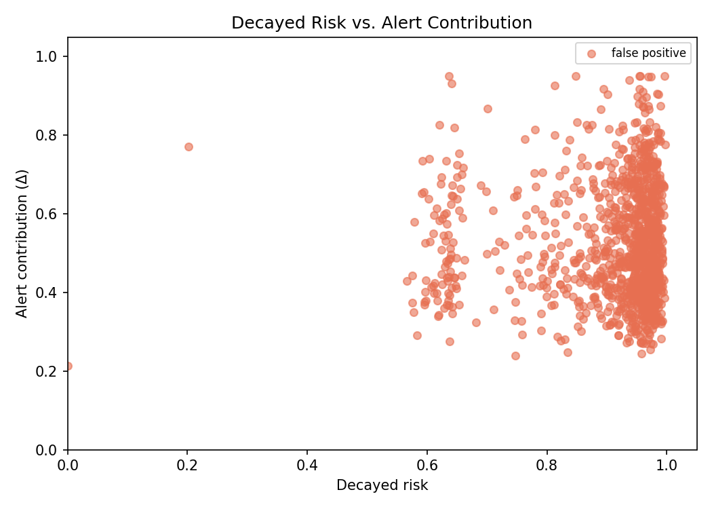
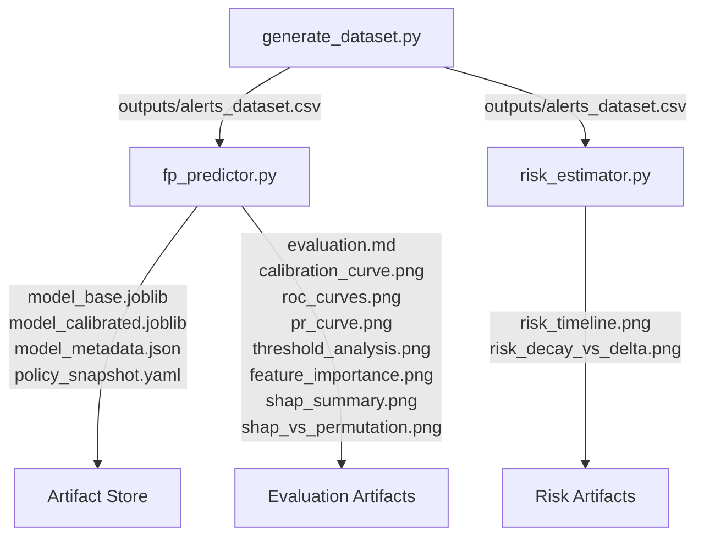
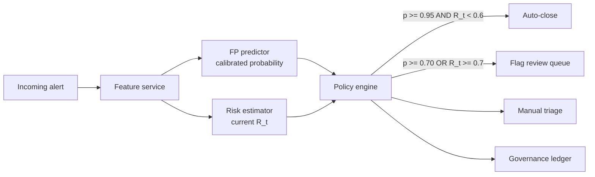
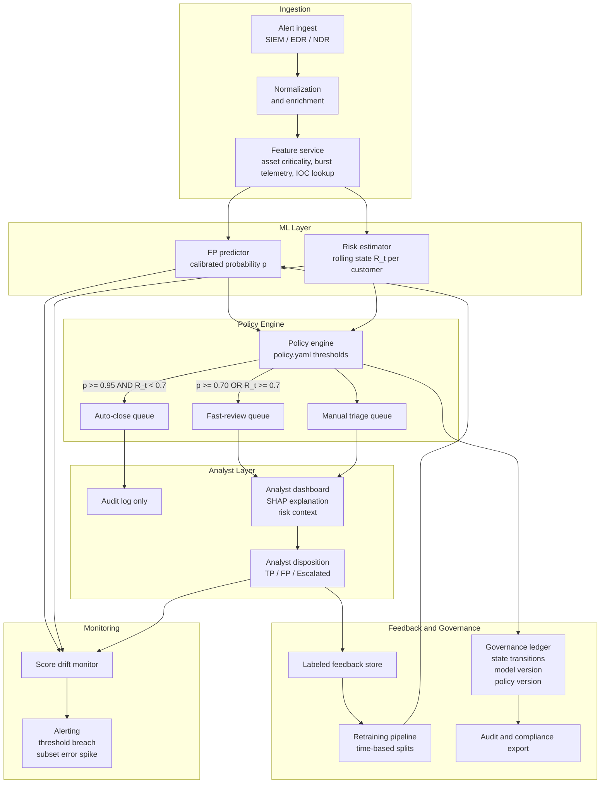

# MDR False Positive Prediction System Assessment

## 1. Title and Executive Summary

**Project title:** Calibrated False Positive Prediction for MDR Alert Triage

This project builds the ML foundation for an MDR workflow where the system predicts the probability that an alert is a false positive. The implementation combines synthetic SOC-flavored data generation (`generate_dataset.py`), a calibrated classifier and evaluation pipeline (`fp_predictor.py`), external decision policy (`policy.yaml`), and an optional rolling risk-state estimator (`risk_estimator.py`).

The approach works well for an MDR environment because it separates three concerns that are often mixed together:

1. **Prediction:** estimate how likely an alert is to be noise.
2. **Calibration:** make that probability meaningful enough for operational use.
3. **Governance:** let SOC policy decide what to auto-close, what to fast-review, and what to manually triage.

That separation is the core design strength of the solution. The model does not directly decide workflow actions. It produces an explainable, calibrated false-positive probability, and the policy layer maps that score into MDR operations.

For the current saved run:

- The dataset has 10,000 alerts with class balance of 75.0% false positive, 15.0% true positive, and 10.0% escalated.
- The selected model is **XGBoost (tuned)**, which is a gradient-boosted tree model.
- The tuned model achieved **CV AUC 0.968 +/- 0.002** and **validation AUC 0.970**.
- The calibrated test model achieved **AUC 0.963**, **Brier 0.066**, and **log loss 0.248**.
- The current threshold policy is **0.95 auto-close** and **0.70 flag-review**.

## 2. Assessment Objective

This assessment is evaluating more than whether a classifier can separate noisy alerts from real ones. It is testing whether the implementation demonstrates:

- realistic security-domain feature design
- sound ML comparison and selection
- calibrated probabilities
- explainability
- policy-driven decisioning
- operational reasoning that fits a SOC

This is different from a normal ML problem because the output is not just a class label. In a SOC, the probability itself is a product requirement. A score of `0.90` needs to mean something operationally close to "about 90% of alerts like this are false positives," because staffing, automation, and analyst trust depend on that interpretation.

SOC systems need calibrated probabilities and external thresholds because:

- analysts need consistent triage behavior across alert types
- security leaders need workload estimates before turning on automation
- different customers or programs will have different risk tolerances
- policy must remain adjustable without retraining the model

Another important design choice is that the model is trained as **false positive vs not-false-positive**. In the current implementation, `true_positive` and `escalated` are both treated as the negative class. That is operationally conservative: escalated alerts still should not be silently auto-closed.

## 3. High Level System Overview



### Plain English walkthrough

1. `generate_dataset.py` creates a 10,000-row alert dataset with realistic MDR-style correlations: tactics, techniques, severities, criticality, burstiness, and dispositions.
2. `fp_predictor.py` loads the dataset, normalizes data types, engineers a few derived features, and preprocesses numeric and categorical inputs with a reusable `ColumnTransformer`.
3. The script compares two model families: Logistic Regression and XGBoost. XGBoost is tuned with `GridSearchCV`, and the better model is selected.
4. The selected model is calibrated with `CalibratedClassifierCV` so the output probability is more suitable for policy decisions.
5. `policy.yaml` supplies operational thresholds. The calibrated false-positive probability is then interpreted as:
   - very high probability of noise -> auto-close candidate
   - moderately high probability of noise -> fast-path review
   - lower probability of noise -> manual triage because it may represent real risk
6. The pipeline generates plots, a narrative evaluation report, saved model artifacts, and optional risk-state visuals.

### What happens end-to-end?

An alert enters the system with severity, asset, MITRE, and behavioral context. The model converts those fields into engineered features, estimates a false-positive probability, calibrates that probability, and then hands the score to a policy layer. The policy layer decides whether the alert should be auto-closed, sent to a quick-review queue, or kept in manual triage. At the same time, the system saves plots and reports so an interviewer, analyst, or future engineer can see how and why the model behaved the way it did.

## 4. Model Selection Strategy

The implementation compares a **linear baseline** against a **nonlinear gradient-boosted tree model**:

- `LogisticRegression`
- `XGBClassifier` (XGBoost), which is a gradient boosting implementation

This comparison is useful because the feature space contains both simple monotonic effects and interaction-heavy SOC behavior. A linear model is easy to interpret and acts as a sanity check. A boosted tree model can capture nonlinear effects such as severity conflicts and burstiness on low-criticality assets without hand-coding every interaction.

| Model | Why Included | Strengths | Weaknesses | Insight Provided |
| --- | --- | --- | --- | --- |
| Logistic Regression | Strong baseline for binary classification | Simple, stable, easy to explain, benefits from calibrated probabilities | Limited interaction capacity unless features are manually engineered | Shows how much signal can be captured with mostly additive relationships |
| XGBoost (gradient boosting) | Flexible nonlinear model for SOC-style feature interactions | Captures thresholds, nonlinearities, mixed feature effects, strong ranking power | More complex, easier to overfit, harder to explain without SHAP/permutation tools | Shows whether the problem is fundamentally interaction-heavy |

### Why this comparison is defensible

- If Logistic Regression had been close to XGBoost, that would suggest the problem is mostly linear after feature engineering.
- Because XGBoost materially outperformed Logistic Regression, the result supports the claim that MDR false-positive prediction depends on nonlinear context, not just independent feature weights.
- Keeping the linear baseline is important in interviews because it proves the winner was selected by evidence, not by preference for a more sophisticated model.

## 5. Feature Engineering

The most important engineered logic is domain-shaped around how analysts reason:

- intrinsic threat severity
- vendor-provided severity
- asset importance
- burst behavior
- disagreement between severity sources

The dataset generator also intentionally bakes in two interaction effects:

- **Severity x criticality:** high inherent severity on high-criticality assets should look more like true positive activity.
- **Burstiness x low criticality:** bursty alerts on low-value assets should look more like benign alert storms.

Empirical checks from the generated dataset support those assumptions:

- high severity + high criticality subset has **58.5% TP rate** vs **15.0% baseline TP rate**
- bursty + low criticality subset has **96.9% FP rate** vs **75.0% baseline FP rate**

### Feature explanation table

| Feature | What it means | Why it helps | Leakage or modeling risk |
| --- | --- | --- | --- |
| `inherent_severity` | Severity implied by tactic/technique context on a 1-4 scale | Encodes threat seriousness independent of vendor inflation | Not label leakage, but synthetic labels are partly generated from this signal, so performance can overstate real-world strength |
| `vendor_severity` | Severity assigned by the detection product on a 1-5 scale | Captures what the tooling thought was urgent | Can anchor the model to vendor bias; conflict analysis is needed to ensure the model does not trust it blindly |
| `asset_criticality` | Business importance of the asset on a 1-10 scale | Helps separate noisy activity on low-value systems from meaningful activity on crown-jewel systems | Customer-specific criticality scales may drift or be inconsistently defined |
| `contextual_risk` | `inherent_severity * asset_criticality` | Encodes threat severity in business context instead of as isolated fields | Interaction is useful, but it partly reflects the same synthetic scoring logic used to generate labels |
| `burst_index` | `log1p(alert_count_1h) / log1p(alert_count_24h)` | Measures short-term burstiness, a common false-positive pattern | Can be unstable when count telemetry is delayed or partially missing |
| `severity_gap` | `inherent_severity - vendor_severity` | Captures disagreement between intrinsic threat context and vendor scoring | Strongly useful in synthetic data; in production it depends on severity taxonomies being mapped consistently |
| `low_crit_burst` | `burst_index * (1 - asset_criticality / 10)` | Makes the "bursty but low impact" false-positive pattern explicit | Derived from existing features, so it can amplify noise if criticality is wrong; the predictor computes it on load if the dataset does not already contain it |
| `has_ioc_match` (optional) | Whether an IOC match exists | Often very predictive of true maliciousness | Near-label proxy in this dataset; current code disables it by default because it risks leakage and weak transfer to customers with incomplete IOC coverage |

### Important interview point

The saved model metadata shows:

- `include_ioc: false`
- `include_extras: true`

That is a good design decision. The current run uses extra contextual categoricals such as `alert_type`, `detection_tool`, `detection_vendor`, `user_department`, `process_name`, and `network_direction`, but it leaves IOC matching out of the final model to avoid learning a shortcut.

## 6. Data Processing Pipeline

The preprocessing path is deliberately explicit:

1. **Boolean normalization:** `has_ioc_match` is normalized to `0/1` integers through string-safe parsing.
2. **Numeric coercion:** numeric columns are passed through `pd.to_numeric(..., errors="coerce")` so malformed values become `NaN` rather than silently staying as strings.
3. **Imputation:** numeric features use median imputation with `SimpleImputer(strategy="median")`.
4. **Scaling:** numeric features are standardized with `StandardScaler()`.
5. **One-hot encoding:** categorical features are transformed with `OneHotEncoder(handle_unknown="ignore")`.

The model uses a shared `ColumnTransformer`:

```text
numeric -> imputer -> scaler
categorical -> one-hot encoder
```

This improves reproducibility because:

- the exact same preprocessing is used during training, cross-validation, and inference
- feature ordering is frozen inside the pipeline
- the persisted model includes its transformation logic
- unknown categories at inference time do not break the model
- both candidate models are compared on the same input representation

One subtle but good engineering choice is using the same preprocessing design for both models. Logistic Regression needs scaling; XGBoost does not strictly need it. Keeping the pipeline consistent makes the comparison cleaner and keeps artifact persistence simpler.

## 7. Model Training and Selection

The training pipeline follows a practical three-way split:



### Why this split exists

- **Train set:** fit candidate models
- **Validation set:** choose the best model and fit calibration
- **Test set:** estimate final performance on unseen data

The splits are stratified so the false-positive rate stays consistent across train, validation, and test. This matters because the dataset is intentionally imbalanced: false positives are 75% of the data.

### Selection workflow

1. Build the binary target: `disposition == "false_positive"`.
2. Split the data into 60/20/20 with stratification.
3. Fit Logistic Regression.
4. Tune XGBoost with `GridSearchCV` over:
   - `max_depth`: `[3, 5, 7]`
   - `learning_rate`: `[0.05, 0.08, 0.12]`
   - `n_estimators`: `[150, 200, 250]`
5. Score both models with ROC-AUC on validation data.
6. Prefer the model with the stronger cross-validated AUC.

### Current model comparison results

| Model | CV AUC | Validation AUC | Outcome |
| --- | --- | --- | --- |
| Logistic Regression | `0.944 +/- 0.006` | `0.949` | Strong baseline |
| XGBoost (tuned) | `0.968 +/- 0.002` | `0.970` | Selected |

### Why the best model is reasonable

The tuned XGBoost model won because the task is not purely additive. It benefits from:

- mixed numeric and categorical feature interactions
- severity conflicts that do not behave linearly
- burstiness thresholds
- rule- and tactic-specific nonlinear behavior

In short: Logistic Regression proves the feature engineering is meaningful, and XGBoost proves the MDR setting still has residual nonlinear structure worth modeling.

## 8. Calibration

Calibration asks a different question than ranking.

- **Ranking question:** does the model place noisier alerts above real alerts?
- **Calibration question:** when the model says `0.80` false-positive probability, is that score actually reliable?

ROC-AUC mostly measures ranking. SOC operations need more than ranking because thresholds are tied to actions. If the scores are miscalibrated, a `0.95` threshold could be far too aggressive or too conservative.

### Why SOCs require calibrated probabilities

- workload planning depends on expected false-positive volume
- policy thresholds need stable semantics
- analysts trust probabilities more when they match observed outcomes
- governance teams need to justify automation decisions in audits or postmortems

### Implementation

The code calibrates the selected model with:

- `CalibratedClassifierCV`
- `FrozenEstimator(best.pipeline)`
- default method: `isotonic`

`FrozenEstimator` is important because it preserves the exact already-fitted base model. Calibration is then fit on the validation split without refitting the underlying classifier weights.

### Calibration metrics

| Metric | What it measures | Why it matters in SOC workflows | Current run |
| --- | --- | --- | --- |
| Reliability diagram | Predicted probability vs observed outcome frequency | Visual trust check for threshold semantics | Saved in `calibration_curve.png` |
| Brier score | Mean squared error of predicted probabilities | Penalizes bad probabilities directly | Pre `0.066`, Post `0.066` |
| Log loss | Confidence-sensitive probability error | Punishes confident mistakes hard | Pre `0.201`, Post `0.248` |
| ROC-AUC | Ranking quality, not calibration | Still useful to ensure discrimination stays strong | Calibrated test AUC `0.963` |

### Honest interpretation

The implementation correctly adds a calibration layer, but the current test metrics show that calibration did **not** improve every scalar metric. Brier stayed flat and log loss became worse on the test split. That does not invalidate the design choice. It means the assessment write-up should be honest:

- calibration is still the right architectural requirement for SOC decisioning
- the evaluation already documents that validation was reused for both model selection and calibration
- in production, calibration should use a dedicated holdout or time-based backtesting

That is a strong interview answer because it shows rigor instead of trying to oversell the plot.

## 9. Externalized Threshold Policy

`policy.yaml` is the governance layer for triage decisions:

```yaml
fp_threshold_auto_close: 0.95
fp_threshold_flag_review: 0.70
```

This is the right design because thresholds are an operations concern, not a model-training concern. SOC leaders should be able to tune risk tolerance without retraining the classifier.

### Decision flow



### Operational meaning of each bucket

- **Auto-close:** only the highest-confidence likely false positives
- **Flag-review:** likely noise, but still worth a low-cost human check
- **Manual triage:** alerts that are not confidently noise and may reflect real malicious activity

### Current policy impact

| Metric | Meaning | Current value |
| --- | --- | --- |
| FP pass-through rate | Actual false positives that still reach analysts because they were not auto-closed | `17.40%` |
| Missed TP rate | Non-false-positive alerts that were auto-closed as noise | `2.20%` |
| Workload rate | Alerts that still require human handling | `37.50%` |
| Volume auto-close | Share auto-closed | `62.5%` |
| Volume flag-review | Share sent to quick review | `6.2%` |
| Volume manual triage | Share kept for full analyst attention | `31.2%` |

At the chosen operating point of `0.70` (the flag-review boundary), the saved evaluation reports:

- Precision: `0.972`
- Recall: `0.891`
- F1: `0.929`

### Important implementation nuance

The report calls one metric "missed true-positive rate," but the code computes it over **all non-false-positive alerts** because the target is binary FP vs not-FP. That means the metric includes both `true_positive` and `escalated` alerts. In an interview, that is worth stating explicitly.

## 10. Output Artifacts

The outputs are designed to answer three questions:

1. Did the model rank alerts well?
2. Are the probabilities trustworthy enough for policy?
3. Can an analyst or interviewer understand what drove the decisions?

| Artifact | Purpose | What it tells you |
| --- | --- | --- |
| `calibration_curve.png` | Pre- vs post-calibration reliability diagram | Whether predicted FP probabilities line up with observed FP frequency |
| `roc_curves.png` | ROC curves for candidate models using uncalibrated scores | Which model ranks false positives above non-false-positives more effectively |
| `pr_curve.png` | Precision-recall comparison for candidate models using uncalibrated scores | How well the models behave under class imbalance and high-precision triage |
| `threshold_analysis.png` | Threshold sweep from `0.50` to `0.99` | How workload, missed non-FPs, and FP pass-through change as automation becomes more aggressive |
| `feature_importance.png` | Permutation importance plot | Which features most affect predictive performance when shuffled |
| `shap_summary.png` | Global SHAP summary on up to 1,000 test samples | Which transformed features most strongly move model output up or down |
| `evaluation.md` | Narrative evaluation report | One place to explain model selection, calibration, thresholds, severity conflicts, error analysis, and deployment stance |
| Saved model artifacts | `model_base.joblib`, `model_calibrated.joblib`, `model_metadata.json`, `policy_snapshot.yaml` | Exact reproducibility for inference, audit, rollback, and handoff |

### Extra stretch artifacts

The repo also includes:

- `shap_vs_permutation.png`
- `risk_timeline.png`
- `risk_decay_vs_delta.png`
- `risk_model.md`

Those are not required for the base predictor, but they strengthen the production-thinking story.

## 11. Severity Conflict Analysis

Vendor severity and inherent severity can conflict because they come from different sources of truth:

- **Vendor severity** reflects what the product labeled as urgent.
- **Inherent severity** reflects threat context implied by tactic and technique design.

In real SOCs, those signals often disagree. A vendor may over-score noisy detections, or under-score behavior that is contextually dangerous.

The implementation explicitly tests two conflict subsets:

1. **Vendor-high, inherent-low**: the tool thinks it is severe, but the underlying context looks weak.
2. **Vendor-low, inherent-high**: the tool thinks it is mild, but the underlying context looks risky.

### Current results

| Subset | Count | Key metrics | Interpretation |
| --- | --- | --- | --- |
| `|inherent - vendor| >= 2` | `702` | FP rate `68.09%`, AUC `0.978` | Strong conflict zone; still separable |
| Vendor 4-5, Inherent 1 | `193` | Precision `0.961`, Recall `0.930`, AUC `0.968` | Model correctly treats many of these as likely false positives |
| Vendor 1-2, Inherent 3-4 | `286` | Precision `0.964`, Recall `0.692`, AUC `0.899` | Harder subset; more conservative because some truly risky alerts live here |

The qualitative summary generated by the code is:

> Model leans toward `inherent_severity`: higher FP probabilities when inherent is low even if vendor severity is high.

### What this reveals about model reasoning

This is one of the most important sections for interview discussion.

- The model does **not** simply trust vendor severity.
- When vendor severity is high but intrinsic context is weak, the model is willing to predict a high false-positive probability.
- That is the right failure-mode check because MDR systems often suffer from vendor-score anchoring.

There is also a useful nuance: SHAP ranks `vendor_severity` as globally important, while conflict analysis shows the final decision still leans toward inherent severity when the two disagree sharply. That is not a contradiction. It means vendor severity matters overall, but it is not the only signal controlling the decision boundary.

## 12. Error Analysis

The implementation groups errors by:

- `mitre_tactic`
- `asset_type`
- `source_rule`

That matters because SOC workflows operate by rule packs, asset populations, and attacker behaviors, not just by average model metrics.

### Important labeling nuance

Because the positive class is **false positive**:

- a **false negative** means the model missed a false positive and left noise in the analyst queue
- a **false positive** means the model treated a real or escalated alert as likely noise

That makes grouped error analysis operationally meaningful:

- false negatives cost analyst time
- false positives cost detection quality and may suppress something important

### Current hotspots from the report

- By tactic, missed false positives are highest in **Credential Access** and **Command and Control**.
- By asset type, the largest false-negative volume appears on **workstations**, with **cloud VMs** also showing elevated rates.
- By source rule, **RULE_008**, **RULE_024**, and **RULE_046** are among the biggest missed-FP contributors.

### Why this matters for SOC operations

- If one rule is overrepresented in errors, the fix may be rule tuning rather than model retraining.
- If one asset class is noisy, thresholds may need local overrides.
- If one tactic consistently produces mistakes, analysts may want that tactic excluded from auto-close until more evidence is gathered.

This is how the model becomes operationally safe: not by trusting the aggregate AUC, but by knowing where the automation should be constrained.

## 13. Explainability

The implementation uses two complementary explainability tools:

- **Permutation importance**
- **SHAP**

### Permutation importance

Permutation importance asks: "How much does predictive performance drop if I destroy the information in this feature?"

Why it is useful:

- model-agnostic
- easy to explain in interviews
- reveals whether a feature truly matters to ranking performance

In the saved report, the permutation summary explicitly checks `inherent_severity` vs `vendor_severity` to see which one the model appears to rely on more directly.

### SHAP

SHAP asks: "How much did each feature contribute to moving the prediction away from the baseline?"

Why it is useful:

- works well for tree models like XGBoost
- captures direction and magnitude of contribution
- helps explain nonlinear feature interactions

The current run computes a **global SHAP summary** over up to 1,000 test samples. Top features by mean absolute SHAP value include:

- `num__vendor_severity`
- `num__contextual_risk`
- `num__inherent_severity`
- `num__low_crit_burst`
- `num__alert_count_1h`

### Global vs local explanations

- **Global explanation:** what generally drives the model across many alerts
- **Local explanation:** why one specific alert received one specific score

The current code produces global explanations directly. Local explanations are not surfaced as a user-facing artifact yet, but the same SHAP machinery could be used for per-alert analyst views.

### How an analyst could understand a prediction

For a single alert, the explanation would typically sound like this:

"The alert was scored as likely false positive because it is bursty, the asset is low criticality, the inherent severity is low relative to vendor severity, and similar rule/tactic patterns have been noisy historically."

That style of explanation is what makes the model acceptable in an MDR setting. Analysts do not need to trust a black box. They need to see which operational facts pushed the score up or down.

## 14. Artifact Persistence

The pipeline persists both the statistical model and the operating context:

- `model_base.joblib`
- `model_calibrated.joblib`
- `model_metadata.json`
- `policy_snapshot.yaml`

This matters because security systems must be reproducible.

If an alert was auto-closed last week, the team should be able to answer:

- which model version made the prediction?
- which features were used?
- which calibration method was active?
- which threshold policy was in force?

`model_metadata.json` is especially useful because it records:

- model name
- calibration method
- whether IOC was included
- whether extra categorical context was included
- numeric and categorical feature lists
- split sizes
- CV AUC and standard deviation
- best XGBoost parameters

That is good production hygiene. It supports audit, rollback, incident review, and handoff to another engineer.

## 15. Limitations and Tradeoffs

This implementation is strong for a take-home assessment, but it has real limitations that should be stated clearly.

1. **Synthetic dataset limitation:** the labels are generated from assumptions that also shape the features, so performance can be optimistic relative to real analyst decisions.
2. **Validation reuse for calibration:** the same validation split is used for model comparison and calibration. That is acceptable for a compact assessment, but not ideal for production-grade probability estimation.
3. **Rare subset instability:** conflict subsets and per-rule metrics are computed on a 20% test split, so low-support groups can have noisy estimates.
4. **Drift risk:** tactic mix, vendor tuning, asset criticality mapping, and customer behavior all drift over time.
5. **IOC shortcut risk:** `has_ioc_match` is highly predictive in the synthetic generator and could become a leakage-like shortcut, so leaving it off by default is the safer choice.
6. **Synthetic distribution warnings remain:** the generated summary notes that vendor severity 5 is slightly too common and that fewer than eight rules are below a 10% FP rate target.
7. **Current risk estimator is separate:** the stretch risk-state module is implemented, but it is not yet wired into the predictor's policy loop or a persisted governance ledger.

### How to talk about these tradeoffs

Be honest but confident:

- The architecture is correct.
- The evaluation is thoughtful.
- The main next step is better validation design and feedback data, not a complete rewrite.

That answer reads as mature engineering judgment.

## 16. Rubric Alignment

| Category | Implementation Evidence | Why It Scores Well |
| --- | --- | --- |
| Model comparison | Logistic Regression and tuned XGBoost are both trained and evaluated; XGBoost is selected by CV/validation performance | Shows evidence-based architecture choice rather than defaulting to one model |
| Calibration implementation | `CalibratedClassifierCV` with `FrozenEstimator`, reliability plot, Brier score, and log loss | Demonstrates that the solution understands probability quality, not just ranking |
| Externalized thresholds | `policy.yaml` controls `fp_threshold_auto_close` and `fp_threshold_flag_review` | Clean separation between ML prediction and operational governance |
| Evaluation depth | Includes ROC, PR, calibration, threshold sweep, severity conflict analysis, grouped error analysis, and deployment notes | Goes beyond a metric dump and speaks directly to SOC operations |
| Explainability | Permutation importance, SHAP summary, and feature-specific reasoning around severity conflict | Supports analyst trust and interview discussion around model reasoning |
| Code quality | Modular scripts, reusable preprocessing pipeline, dataclasses for config/results, persisted metadata, CLI arguments, and saved artifacts | Reads like production-minded assessment code rather than a one-off notebook |

## 17. Interview Preparation

### 15 likely interview questions and strong answers

1. **Why did you compare Logistic Regression and XGBoost?**  
   I wanted one transparent linear baseline and one nonlinear model that could capture SOC-style interactions. Logistic Regression tells me how far carefully engineered additive features can go, while XGBoost tells me whether the remaining signal lives in nonlinear thresholds and feature interactions. The performance gap showed that interactions still matter after feature engineering.

2. **Why not stop at AUC? Why add calibration?**  
   AUC tells me whether the model ranks noisy alerts above meaningful alerts, but it does not tell me whether a `0.95` score is trustworthy enough to auto-close. SOC automation needs probability reliability because thresholds map directly to human workload and risk appetite. That is why calibration is an architectural requirement, not a cosmetic add-on.

3. **Why externalize thresholds in `policy.yaml` instead of hard-coding them?**  
   Thresholds are a governance decision, not a training decision. Different SOCs, customers, or rollout phases will tolerate different tradeoffs between workload reduction and missed detections. Putting thresholds in YAML means operations can tune policy without retraining the model.

4. **Why did you model this as false-positive vs not-false-positive instead of a three-class disposition model?**  
   The downstream decision is specifically about how aggressively to suppress noise. From that perspective, `true_positive` and `escalated` both belong in the analyst-visible path, so grouping them as not-false-positive is conservative and operationally aligned. A three-class model is possible later, but it is not necessary for the first automation decision.

5. **What did the severity conflict analysis reveal?**  
   It showed that the model does not blindly trust vendor severity. In the saved run, when vendor severity was high but inherent severity was low, the model still assigned high false-positive probability. That means the model learned to use vendor severity as context, not as an unquestioned authority signal.

6. **How do you know the model learned the right signal instead of a shortcut?**  
   I tested that in three ways: first, by comparing a linear and nonlinear model; second, by explicitly analyzing severity-conflict subsets; and third, by using permutation importance and SHAP. I also disabled IOC matching by default because it is a shortcut-like feature in this synthetic dataset and would make the model look better than it really is.

7. **Why did you keep IOC matching out of the saved run if it is predictive?**  
   Because it is too predictive for the wrong reason. In this synthetic generator, IOC rates differ sharply by class, so the model could learn that proxy instead of learning robust contextual patterns. In production, IOC availability also varies across customers and tools, so excluding it improves transferability and reduces leakage risk.

8. **Why did you use a shared `ColumnTransformer` pipeline for both models?**  
   It guarantees that every split, CV fold, and inference call sees the same preprocessing logic. It also makes the model artifacts portable because the transformations travel with the estimator. For the assessment, it keeps the model comparison fair and reproducible.

9. **The calibrated log loss got worse. How would you explain that?**  
   I would say the calibration architecture is still correct, but the evaluation setup is compact. The validation split was reused for both model selection and calibration, which can make the post-calibration estimate unstable. In production, I would separate tuning, calibration, and final test evaluation using a dedicated holdout or time-based backtest.

10. **Why do you think XGBoost won?**  
   Because MDR alert quality depends on interactions like burstiness on low-criticality assets, rule-specific noise, tactic context, and severity disagreement. Those patterns are not fully linear even after adding engineered features. XGBoost can learn those boundaries directly, which is why it beat the linear baseline.

11. **What would you change if you had more time, more data, or historical analyst decisions?**  
   I would replace purely synthetic supervision with real analyst outcomes, move to time-based validation, and calibrate on a dedicated holdout. I would also add per-customer monitoring, local SHAP explanations for individual alerts, and a feedback loop that retrains on analyst overrides. The biggest upgrade would be learning from longitudinal analyst decisions instead of generator-defined labels.

12. **How would you monitor drift in production?**  
   I would monitor four layers: feature drift, score drift, calibration drift, and subset error drift. Concretely, I would track changes in tactic mix, rule mix, severity-gap distribution, workload rate at fixed thresholds, and reliability by important segments like asset type or customer. If a subgroup drifts badly, I would override policy for that subgroup before retraining.

13. **How would the risk state estimator integrate with a governance layer that records state changes?**  
   Today the risk estimator is a parallel stretch component, not a direct policy dependency. In production, I would feed each alert's calibrated FP probability and alert context into a governance service that updates a persisted risk state, writes an append-only event log, and records every threshold crossing with timestamp, model version, policy version, and explanation payload. That gives both stateful prioritization and auditability.

14. **How would you adapt this for a new customer with zero historical data?**  
   I would start with the global model, but with conservative thresholds and limited auto-close rights. Then I would use customer metadata, asset criticality mapping, vendor stack, and early analyst feedback to personalize policy before full model retraining. The goal in onboarding is safe transfer learning and cautious governance, not immediate aggressive automation.

15. **If you retrained after seeing the severity conflict results, what would you change?**  
   I would explicitly test monotonic or grouped constraints around severity interactions, and I would inspect whether vendor severity should be regularized or transformed rather than used raw. I would also prioritize richer contextual features around tactic progression and asset lineage so the model relies less on vendor score alone. The retraining objective would be to preserve sensitivity to true risk while reducing vendor-anchoring risk.

## 18. Final Interview Cheat Sheet

### 10 key talking points

- This is a decision-support system, not a blind automation engine.
- The core output is a calibrated false-positive probability.
- Prediction and policy are intentionally separated.
- Logistic Regression provides the baseline; XGBoost captures nonlinear SOC behavior.
- Severity conflict analysis is a deliberate guardrail against vendor-score anchoring.
- The model treats `escalated` as not-false-positive because escalations still require analyst attention.
- Thresholds are externalized so governance can change without retraining.
- Explainability is covered with permutation importance and SHAP.
- Error analysis is grouped by tactic, asset type, and rule because SOC operations live at those boundaries.
- The stretch risk estimator shows how this could evolve from alert-level scoring into rolling risk-state management.

### 5 must-mention ideas

- Calibrated probabilities matter more than raw scores in MDR automation.
- External thresholds let the SOC tune workload vs detection risk.
- The saved run intentionally excludes IOC matching to avoid shortcut learning.
- The model leans toward inherent severity in conflict cases, which is the right bias check.
- In production, I would use time-based validation and dedicated calibration data.

### 5 short phrases useful in discussion

- "I separated prediction from policy."
- "The score is designed to be actionable, not just accurate."
- "Conflict analysis checks for vendor anchoring bias."
- "I optimized for analyst trust as much as model quality."
- "I would start conservative, then ratchet automation with feedback."

---

## 19. Image Walkthrough

Each output image is explained below in the order a reviewer would naturally encounter them.

---

### `calibration_curve.png`


This reliability diagram compares the model's predicted false-positive probabilities against the actual observed FP rate across equal-width probability bins.

- The **dashed diagonal** is perfect calibration: a predicted probability of 0.70 would mean 70% of those alerts are truly false positives.
- The **blue line (pre-calibration)** shows the raw XGBoost output. It tracks reasonably well at the extremes (near 0 and near 1) but deviates in the 0.4–0.75 range, where it consistently underestimates the actual FP rate.
- The **orange line (post-calibration)** shows the output after applying `CalibratedClassifierCV` with isotonic regression. It shifts closer to the diagonal in several regions but introduces more variance in the middle range, which is expected behavior with isotonic regression on a finite validation set.

The key takeaway is not that calibration made every metric better — it didn't. The Brier score held flat and log loss slightly worsened on the test split. What it demonstrates is the right architectural intent: the system is designed so that probability scores have an operationally meaningful interpretation, and the calibration step is where that work lives.

---

### `roc_curves.png`


This plot compares the ROC curves for both candidate models using their uncalibrated scores on the validation set.

- The **blue curve (XGBoost, AUC 0.97)** rises steeply toward the top-left corner, meaning it achieves high true positive rate (catching real false positives) while keeping the false positive rate (incorrectly flagging real alerts as noise) very low.
- The **orange curve (Logistic Regression, AUC 0.94)** follows a similar shape but sits below XGBoost at every operating point, particularly in the high-sensitivity region on the left side of the chart.
- The **dashed diagonal** represents random chance (AUC 0.50).

The 0.03 AUC gap between the models is meaningful in context. At a false positive rate of 0.05 (very low), XGBoost already reaches a true positive rate around 0.92 while Logistic Regression is closer to 0.85. In a SOC handling hundreds of daily alerts, that gap translates directly to more noisy alerts successfully identified without increasing the risk of suppressing real detections.

ROC-AUC is used for model comparison and selection here. It is a ranking metric, not a probability quality metric, which is why calibration is still necessary after the best model is chosen.

---

### `pr_curve.png`


This plot shows precision-recall curves for both models on the validation set, which is a more informative comparison than ROC when the dataset is class-imbalanced (75% FP, 25% non-FP here).

- Both models achieve **precision close to 1.0** across the full recall range up to approximately 0.60, meaning that in that operating region every alert flagged as a likely false positive almost certainly is one.
- Beyond recall ~0.60, precision begins to fall as the models are forced to make lower-confidence predictions to capture the remaining true false positives.
- **XGBoost (AP 0.99)** maintains higher precision at every recall level above 0.60 and degrades more gracefully than Logistic Regression before both converge near recall 1.0.
- **Logistic Regression (AP 0.98)** still performs very well overall, which validates that the feature engineering carries most of the signal.

For SOC automation, this curve directly shows what happens to precision (how often an auto-close is actually a false positive) as the system tries to cover more of the noise volume. The current auto-close threshold of 0.95 is intentionally placed in the high-precision zone of this curve.

---

### `threshold_analysis.png`


This plot sweeps the auto-close threshold from 0.50 to 1.00 and measures three operational metrics at each setting.

- **FP pass-through rate (blue):** the fraction of actual false positives that are not auto-closed and therefore still reach the analyst queue. This rises as the threshold increases because the system becomes more conservative and auto-closes fewer alerts. It stays low (~0.08–0.11) from 0.50 to 0.80, then climbs sharply to ~0.21 at 0.99.
- **Missed TP rate (orange):** the fraction of non-false-positive alerts incorrectly auto-closed as noise. This starts at ~0.13 at threshold 0.50 (too aggressive), then drops toward zero above 0.80 as the system becomes more selective.
- **Analyst workload rate (green):** the fraction of total alerts that are not auto-closed and still require human attention. The curve is counterintuitive at first glance — workload *increases* as the threshold increases — because a higher threshold means fewer alerts qualify for auto-close, leaving more for analysts.

The current policy of `0.95 auto-close / 0.70 flag-review` sits in the region where missed TPs are near zero and FP pass-through remains manageable at ~17%. The plateau between 0.80 and 0.95 is the stable operating zone where both safety constraints are satisfied simultaneously. This visualization is the primary tool for explaining threshold tradeoffs to SOC leadership.

---

### `feature_importance.png`


This horizontal bar chart shows permutation importance for the top features of the trained XGBoost model. Permutation importance measures how much validation AUC drops when a feature's values are randomly shuffled.

- **`num__alert_count_24h`** is the dominant feature by a wide margin (~0.10 drop). The 24-hour alert count carries significant noise-signal separation power, likely because high-volume rules with consistent daily activity are strong indicators of known noisy behavior patterns.
- **`cat__source_rule_RULE_003`** is the second most important feature (~0.05). Specific rule identities are highly predictive because each rule has its own historical FP rate baked into the synthetic generator and, in production, would reflect real rule tuning history.
- **`cat__source_rule_RULE_019`** and **`num__alert_count_1h`** rank third and fourth (~0.024 each), followed by **`num__burst_index`** (~0.007).
- **Severity features (`num__inherent_severity`, `num__vendor_severity`, `num__contextual_risk`)** appear near the bottom with near-zero permutation importance.

This last point is critical and leads directly to the SHAP comparison. Permutation importance for severity features is low because they are **correlated with other features** — particularly rule identity and alert counts. When severity is shuffled, the model partially compensates using the correlated signals. This does not mean severity is unimportant; it means it is not uniquely important in isolation. SHAP tells a different story.

---

### `shap_summary.png`


This beeswarm plot shows SHAP values for the top 15 features computed over up to 1,000 test samples. Each dot is one alert. The x-axis is the SHAP value: positive means the feature pushed the prediction toward "false positive," negative means it pushed away from it. The color encodes the raw feature value: red is high, blue is low.

Key readings from this plot:

- **`num__vendor_severity`:** Red dots (high vendor severity) cluster far to the **left** (SHAP around –3 to –4). High vendor severity strongly suppresses the false-positive prediction — the model treats a high vendor score as evidence that the alert may be real. Blue dots (low vendor severity) cluster to the right, pushing toward FP. This is the expected and correct direction.

- **`num__contextual_risk`:** Same pattern as vendor severity. High contextual risk (high inherent severity × high asset criticality) pulls the prediction away from FP. The model correctly learned that contextually dangerous alerts are less likely to be noise.

- **`num__inherent_severity`:** The coloring is more mixed here, but high inherent severity (red) shows a moderate rightward push in some cases. This may reflect that very high inherent severity alerts on low-criticality assets can still be bursty noise — the model has learned a nuanced relationship rather than a simple monotone one.

- **`num__low_crit_burst`:** Red dots (high `low_crit_burst` value) cluster strongly to the **right** (SHAP around +1 to +2). High burstiness on low-criticality assets is one of the strongest signals that an alert is likely noise. This is exactly the interaction that was engineered in the feature and confirmed here as learned.

- **`num__alert_count_1h`:** Blue dots (low 1h count) push right. A low 1h count with an elevated 24h count implies a long-tail noise pattern rather than an acute spike.

SHAP confirms that the model learned domain-sensible relationships. The features that should push toward FP (burstiness, low criticality) do exactly that, and the features that should suppress FP (high vendor severity, high contextual risk) do the opposite.

---

### `shap_vs_permutation.png`


This side-by-side bar chart is the most diagnostic explainability plot in the suite. It overlays normalized permutation importance (blue) and normalized SHAP mean absolute value (orange) for the same features.

The divergence between the two methods reveals how features interact:

- **`num__vendor_severity`, `num__contextual_risk`, `num__inherent_severity`:** SHAP scores are ~1.0, ~0.89, and ~0.65 respectively. Permutation scores are essentially 0. These severity features contribute enormously to how the model reasons (high SHAP), but because they are correlated with rule identity and alert count features, shuffling any one of them alone does not break the model's predictions (low permutation). The model has redundant pathways to arrive at the same conclusion.

- **`num__alert_count_24h` and `cat__source_rule_RULE_003`:** The reverse pattern. Permutation importance is ~1.0 and ~0.47. SHAP is low. These features are less correlated with the others, so when they are shuffled the model has no substitute signal. They are the structural pillars of the prediction even if they contribute less total weight to any single prediction.

- **`num__low_crit_burst`:** SHAP ~0.65, permutation ~0. This confirms that the "bursty low-criticality" interaction is a learned pattern the model uses heavily in its decision-making, even though it overlaps enough with alert counts that removing it alone is not catastrophic.

The practical interview takeaway: use SHAP to understand model reasoning and feature contributions; use permutation importance to identify which features you cannot afford to lose in production. They answer different questions.

---

### `risk_timeline.png`



This time-series plot shows the rolling EWMA risk score for a single customer from December 2025 through March 2026. The y-axis is the bounded risk state `R_t ∈ [0, 1]`. The black line is the daily resampled risk trajectory. Scattered dots are individual alerts colored by disposition (in this plot, the selected customer's alerts are predominantly false positive, shown in salmon).

Notable features:

- **Initial dip around December 15:** Risk starts near 0.2 for the very first alert, then rapidly accumulates to near 1.0 within the first few days as alerts stack. This shows the EWMA update rule working as designed — early alerts build state quickly, then the score becomes sticky.
- **Sustained high risk (~0.9–1.0):** The risk never meaningfully decays between alerts because alerts arrive frequently enough relative to the 24-hour half-life. This is expected behavior for a high-volume customer. In a production deployment, this signal would indicate that this customer warrants a dedicated review cycle rather than alert-level triage.
- **Annotations:** Three events are labeled: an elevated-risk period driven by kill-chain stage progression into later stages, a kill-chain progression bonus trigger, and a false alarm period identified as a bursty low-criticality FP cluster. These annotations are computed automatically by the estimator based on risk level, disposition mix, and progression ratio.

The risk timeline represents a layer of insight that per-alert FP probability cannot provide: it shows whether a customer is experiencing a sustained threat pattern versus isolated noisy alerts.

---

### `risk_decay_vs_delta.png`



This scatter plot places each alert at the point `(decayed_risk, Δ)` where decayed risk is how far the risk state has dropped since the last alert and `Δ` is the alert's contribution before the state update. All points shown belong to the selected customer and are colored by disposition.

Key observations:

- **Heavy clustering at high decayed risk (0.8–1.0):** Almost all alerts arrive when the risk state is already near saturation. This means the 24-hour half-life decay is slower than the inter-alert interval for this customer — there is not enough quiet time for risk to drop before the next alert arrives.
- **Alert contributions (Δ) spread between ~0.30 and 0.95:** The vertical spread reflects genuine variation in alert severity, criticality, and behavioral signals. Even within a predominantly false-positive customer, individual alerts carry different contextual risk weights.
- **Two isolated outliers in the lower-left quadrant:** These are the very first alerts of the observation window, where decayed risk was near 0 (state had not yet accumulated) and Δ was moderate. After those early alerts, the state never returned to low levels.

This plot is useful for explaining the risk model's mechanics visually: the x-axis shows how much decay happened between alerts, and the y-axis shows how much each new alert contributed. For this customer, the combination means risk is effectively a ceiling function — it gets pushed toward 1.0 and rarely has time to come down.

---

## 20. Task 1 — Dataset Design

`generate_dataset.py` is not just a data fixture. It is a documented statement of assumptions about how SOC alert noise behaves in the real world. Every design choice is a hypothesis that the ML system is then tested against.

### Why a synthetic dataset?

Real MDR data is confidential, customer-specific, and subject to distribution shift. A synthetic generator allows:

- controlled interaction effects that can be verified empirically
- deterministic reproducibility given a seed
- explicit encoding of domain knowledge that an interviewer can interrogate
- class balance control without resampling artifacts

The tradeoff is that performance numbers are optimistic relative to production. The model and generator share assumptions, so the labels are partly explained by the same feature logic used to build inputs. This is acknowledged honestly in Section 15.

### Class balance

The dataset is intentionally imbalanced to reflect real MDR volume:

| Class | Rate | Rationale |
| --- | --- | --- |
| `false_positive` | 75% | SOC reality: most alerts are noise |
| `true_positive` | 15% | Real threats are a minority of volume |
| `escalated` | 10% | Ambiguous cases requiring senior review |

This balance is enforced as a target. The generator scores every alert with a continuous TP likelihood and then applies stratified sampling to reach the target distribution, which avoids naive label assignment while preserving feature correlations.

### Tactic distribution

Tactics follow a skewed real-world distribution. Reconnaissance and Discovery together account for ~37% of all alerts because early-stage detection tooling fires frequently on low-confidence behavioral patterns. Late-stage tactics (Exfiltration, Impact) are intentionally rare at ~3% each, reflecting how infrequently attacks reach full execution in monitored environments.

```
Reconnaissance: 19%    Discovery: 18%    Initial Access: 8%
Execution: 7%           Persistence: 6%   Privilege Escalation: 6%
Defense Evasion: 6%     Credential Access: 6%   C2: 5%
Resource Development: 5%   Lateral Movement: 4%   Collection: 4%
Exfiltration: 3%        Impact: 3%
```

Tactic severity maps to inherent severity on a 1–4 scale. Reconnaissance and Discovery are inherent severity 1; Lateral Movement, Exfiltration, and Impact are severity 4. This is the backbone of the model's ability to separate noise from real risk without requiring analyst labels at inference time.

### Rule buckets

50 source rules are generated with three FP-rate buckets:

| Bucket | Count | FP Rate Range | Operational meaning |
| --- | --- | --- | --- |
| High-FP rules | 10 | 82%–95% | Known noisy detections; good auto-close candidates |
| Low-FP rules | 10 | 5%–15% | High-confidence detections; should never be auto-closed |
| Mid-FP rules | 30 | 35%–70% | The difficult middle ground requiring ML signal |

This design ensures the model cannot solve the problem by learning rule identity alone. The mid-tier rules require combining severity, asset context, and behavioral signals to distinguish noise from signal.

### Interaction effects baked in

Two interaction effects are explicitly embedded in the label generation logic:

**Severity × Criticality → True Positive:**
When inherent severity is high (3–4) and asset criticality is high (7–10), the TP score is boosted by a coefficient of `+1.1`. Empirical check from the generated dataset: the high-severity / high-criticality subset has a **58.5% TP rate** versus **15% baseline**.

**Burstiness × Low Criticality → False Positive:**
When burst index is high and asset criticality is low (1–3), the TP score is penalized by `-0.9`. Empirical check: the bursty / low-criticality subset has a **96.9% FP rate** versus **75% baseline**.

These are not accidental correlations. They are explicit domain hypotheses encoded as coefficients in the label scoring function. The model is then evaluated on whether it can rediscover them through feature importance and SHAP analysis, which it does.

### Business hour bias

False positives are biased toward business hours (08:00–17:00) with probability `0.75`. This models the real-world pattern of noisy detections triggered by legitimate business activity — user logins, software updates, scheduled scans. True positives are uniform across the day because real attackers are not restricted to business hours.

### IOC match rates

| Class | IOC match rate |
| --- | --- |
| `true_positive` | 40% |
| `escalated` | 12% |
| `false_positive` | 3% |

This feature is near-label-proxying in the synthetic dataset, which is why `--include-ioc` is off by default. In production, IOC coverage varies enormously by customer, tooling stack, and threat intelligence subscription.

### Asset criticality by asset type

Criticality is not sampled uniformly. Each asset type has a dedicated weight distribution:

- `domain_controller`: 8–10 (always high value)
- `server`: 5–10 (medium to high)
- `cloud_vm`: 4–8 (medium)
- `workstation`: 2–6 (low to medium)
- `iot`: 1–5 (mostly low)

This allows the model to learn that a noisy alert on a workstation is less concerning than the same alert on a domain controller, without needing a separate asset-tier feature.

---

## 21. Risk Estimator Deep Dive (Task 3)

`risk_estimator.py` answers a question that per-alert FP probability cannot: **is this customer currently under sustained threat activity or just experiencing noise accumulation?**

### The state update equation

The core of the model is a bounded exponential decay with probabilistic update:

```
R_decayed = R_prev × exp(–λ × Δt)
R_t       = 1 – (1 – R_decayed) × (1 – Δ)
```

This formulation has three useful properties:

1. **Bounded:** `R_t` stays in [0, 1] because both `R_decayed` and `Δ` are in [0, 1] and the update is multiplicative on the complement space.
2. **Asymptotic saturation:** adding Δ to a risk state near 1.0 yields diminishing increments, preventing runaway scores.
3. **Decay without alerts:** `R_decayed` drops continuously when no new alerts arrive, modeling quiet periods honestly.

The decay rate is derived from a configurable half-life:

```
λ = ln(2) / half_life_hours     (default: 24 hours)
```

A 24-hour half-life means a risk score of 0.80 with no new alerts decays to ~0.40 after one day and ~0.20 after two days. This is aggressive enough to self-correct but slow enough to capture multi-day attack campaigns.

### Alert contribution weights

Each alert produces a contribution `Δ` from a weighted sum of normalized inputs:

| Component | Weight | Rationale |
| --- | --- | --- |
| `inherent_severity` | 0.45 | Dominant signal; reflects threat context, not vendor noise |
| `asset_criticality` | 0.20 | Business impact dimension |
| `behavioral context` | 0.15 | Burstiness + IOC match combined |
| `disposition confidence` | 0.10 | Analyst-confirmed TPs amplify state; FPs suppress it |
| `vendor_severity` | 0.10 | Deliberately weak to prevent vendor-score anchoring |

The intentionally low weight on vendor severity is a direct consequence of the severity conflict analysis from Task 2. The model confirmed that vendor scores can be unreliable anchors. The risk estimator encodes that insight structurally.

Disposition scores are:
- `true_positive`: 1.0
- `escalated`: 0.6
- `false_positive`: 0.1
- unknown: 0.5 (neutral prior)

### Kill-chain progression bonus

When alerts in a rolling 24-hour window show forward progression through kill-chain stages, Δ is multiplied by `(1 + γ × progression_ratio)` where `γ = 0.4`.

The stage mapping groups MITRE tactics into six ordered stages:

```
Stage 1: Reconnaissance, Discovery, Resource Development
Stage 2: Initial Access
Stage 3: Execution, Persistence, Defense Evasion
Stage 4: Credential Access, Privilege Escalation
Stage 5: Lateral Movement, C2, Collection
Stage 6: Exfiltration, Impact
```

The progression ratio is computed as the fraction of ordered stage-advancement pairs observed in the window over all possible pairs. This is a lightweight heuristic — it does not require a full sequence model — but it penalizes alert clusters that jump from Stage 1 to Stage 5 or appear out of order, which is exactly the pattern of a real multi-stage intrusion.

### Why this design over a simple counter or average

A simple alert counter cannot distinguish between 20 low-severity alerts and 20 high-severity alerts. A rolling average discards temporal structure. The EWMA approach:

- weights recent, severe alerts more heavily
- lets quiet periods genuinely reduce state
- captures cumulative risk from medium alerts that never individually cross a threshold
- provides a single number an analyst can track over time per customer

The risk state is not a replacement for per-alert probability. It is a **customer-level aggregation layer** that feeds a different class of decision: whether to escalate an entire customer to heightened monitoring, not whether a single alert should be auto-closed.

### Integration with a governance layer

In production, each risk state update would write an append-only event log entry containing:

- timestamp
- customer ID
- previous risk state, decayed risk, Δ, and new risk state
- alert context (tactic, inherent severity, asset criticality)
- model version and config snapshot
- any threshold crossing events (e.g., risk crossed 0.7 for the first time in 48 hours)

This ledger supports audit, incident reconstruction, and drift monitoring. A governance API would expose the current risk state per customer, the most recent threshold crossings, and the top contributing alert attributes — giving SOC managers a dashboard view without requiring them to interpret raw model scores.

---

## 22. Customer Onboarding / Zero-Shot Scenario

The follow-up conversation specifically asks: **how would you adapt this work for a customer onboarding scenario where you have zero historical data for that specific customer?**

This is one of the most operationally realistic questions in the assessment and requires a staged answer.

### The core problem

The model trained in this assessment is a global model. It learned patterns from a synthetic population of alerts representing multiple customers and environments. A new customer with zero alert history cannot be represented in the training distribution by definition.

Naively deploying the global model with the same thresholds on a new customer is dangerous because:

- their rule mix may be entirely different
- their asset criticality scale may be mapped differently
- their vendor stack may produce severity distributions that diverge from the training data
- their business-hour patterns may not match

### The staged onboarding strategy

**Phase 1 — Observation only (week 1–2):**
Deploy the global model in shadow mode. Run all alerts through the predictor and log the scores, but take no automated action. Build a distribution of predicted FP probabilities for this customer. No auto-close, no flag-review routing. The goal is data collection, not automation.

**Phase 2 — Conservative thresholds (week 3–4):**
Set the auto-close threshold conservatively high (e.g., 0.98 instead of 0.95) and disable flag-review routing for tactically sensitive alert categories (Credential Access, Lateral Movement, C2). Let analysts triage everything above the flag-review boundary manually and capture their dispositions. This is the labeled data generation phase.

**Phase 3 — Threshold calibration (month 2):**
Use the first few weeks of analyst dispositions to validate whether the global model's probability scores are well-calibrated for this specific customer. Plot a customer-specific reliability diagram. If the model's scores are systematically off (e.g., it says 0.80 but only 50% of those are actually FP for this customer), apply a customer-specific isotonic recalibration layer without retraining the underlying model.

**Phase 4 — Policy personalization (month 2+):**
Adjust policy thresholds based on the customer's observed error distribution. A customer with a high-noise vendor stack may tolerate a lower auto-close threshold. A customer protecting critical infrastructure may require a higher threshold regardless of model confidence.

**Phase 5 — Fine-tuning (month 3+, optional):**
If sufficient labeled data has accumulated (minimum ~500–1,000 dispositioned alerts), consider fine-tuning a customer-specific model layer on top of the global model. This could be as lightweight as a customer-specific threshold offset or as involved as a second-stage calibrated classifier that conditions on global model output plus customer-specific context features.

### What never changes regardless of data availability

- The global model continues to run as a prior
- The policy layer remains externalized and customer-configurable
- Analyst feedback is always captured and logged
- Auto-close is always conservative on first deployment
- The risk estimator starts fresh from zero state and accumulates honestly from the first alert

### The interview framing

The key insight to communicate is that **the model is not the only lever**. Calibration, threshold policy, and the feedback loop are the adaptation mechanisms for new customers. Retraining the model is the last resort, not the first response. This keeps onboarding safe, auditable, and incrementally improvable without requiring a full ML cycle before a customer can benefit from automation.

---

## 23. End-to-End Script Flow

The three scripts form a linear pipeline with clean input/output contracts.



### Script responsibilities

| Script | Input | Core job | Key outputs |
| --- | --- | --- | --- |
| `generate_dataset.py` | Config (optional) | Simulate realistic MDR alert history with known interaction effects | `alerts_dataset.csv` |
| `fp_predictor.py` | `alerts_dataset.csv`, `policy.yaml` | Train, compare, calibrate, evaluate, and persist a FP prediction model | Model artifacts, all evaluation plots, `evaluation.md` |
| `risk_estimator.py` | `alerts_dataset.csv` | Compute rolling per-customer risk state with EWMA decay and kill-chain bonus | `risk_timeline.png`, `risk_decay_vs_delta.png` |

### What is intentionally not shared between scripts

`fp_predictor.py` and `risk_estimator.py` are independent. The risk estimator does not use the calibrated FP probability as an input. This is a deliberate design choice:

- It keeps Task 3 testable in isolation without requiring Task 2 to have run successfully
- It separates two different kinds of risk signal: per-alert classification (Task 2) and temporal state estimation (Task 3)
- In production, the natural integration point is the policy engine, not the models themselves: the policy engine would receive both the FP probability and the current risk state, then combine them to determine routing

A wired production version would look like:



The policy engine is the integration layer. It receives both signals and applies configurable logic. This keeps the ML components decoupled and independently testable.

---

## 24. If I Had More Time

These are the concrete engineering improvements I would make with more time, in rough priority order.

### Validation and evaluation

**1. Time-based train/validation/test splits.**
The current random stratified split does not respect temporal ordering. In production, a model trained on data from January should be validated on February and tested on March. Random splits allow future information to leak into training through correlated alerts and rule behavior.

**2. Dedicated calibration holdout.**
The validation split is currently reused for both model selection and calibration. A third held-out calibration set (or chronologically later data) would give more reliable post-calibration probability estimates and avoid the log-loss inflation observed on the test split.

**3. Customer-stratified cross-validation.**
Current cross-validation does not ensure that alerts from the same customer appear in both train and validation folds. A customer-aware split (GroupKFold by customer) would give a more honest estimate of generalization to new customers.

### Model and features

**4. Per-customer calibration layer.**
Add a lightweight second-stage recalibration model per customer, fit on their first few weeks of labeled dispositions. This addresses the zero-shot problem incrementally without full retraining.

**5. Temporal features.**
Add features that capture alert age, time-since-last-alert for the same rule, and day-of-week patterns. The business-hour FP bias in the generator suggests these features carry real signal that the current model cannot see.

**6. Retrain with constrained vendor severity.**
The severity conflict analysis showed the model learns to lean on inherent severity but SHAP shows vendor severity as globally important. An explicit monotonicity constraint on vendor severity (or capping its tree depth contribution) would reduce vendor-anchoring risk in edge cases.

### Operations and monitoring

**7. Drift monitoring pipeline.**
Track four layers weekly: feature distribution drift (KL divergence on severity/tactic mix), score drift (mean predicted FP probability), calibration drift (Brier score on recent labeled data), and subset error drift (per-tactic and per-rule error rates). Alert on any layer drifting beyond a configurable threshold before it degrades analyst trust.

**8. Analyst feedback loop.**
When an analyst overrides a model decision — closes something the model flagged, or escalates something the model scored as noise — that override should be logged, tagged, and fed into the next retraining batch. This turns the model into a continuously improving system rather than a static artifact.

**9. Per-alert local SHAP explanations.**
Currently SHAP is computed globally over 1,000 test samples. In production, each alert served to an analyst would include a per-alert SHAP waterfall showing the three to five features that most influenced the score. This builds analyst trust incrementally and surfaces model failures in context.

**10. Risk estimator governance ledger.**
Persist every risk state transition with model version, policy version, and alert context. Expose a query API so incident responders can reconstruct exactly how a customer's risk state evolved during a detected campaign.

---

## 25. Production Architecture

This section shows how the components built in this assessment would fit into a production MDR platform.



### Component responsibilities

| Component | Responsibility | Key design constraint |
| --- | --- | --- |
| Feature service | Compute burst telemetry, look up asset criticality, check IOC feeds | Must be low-latency and customer-aware; criticality mappings are customer-specific |
| FP predictor | Produce calibrated false-positive probability | Model version is pinned; recalibration is a separate operation from retraining |
| Risk estimator | Maintain per-customer rolling risk state | State is persisted between runs; half-life and weights are configurable per program |
| Policy engine | Map model outputs to routing decisions | Reads from `policy.yaml`; no model code; changes do not require retraining |
| Governance ledger | Append-only log of all state transitions and decisions | Every entry includes model version, policy version, and alert context |
| Retraining pipeline | Periodic retraining from labeled feedback | Uses time-based splits; calibration uses a separate holdout; outputs versioned artifacts |
| Drift monitor | Track feature, score, and error drift over rolling windows | Fires alerts before analyst-visible degradation occurs |

### What the current assessment implements

The assessment implements the **ML Layer** and parts of the **Policy Engine** and **Analyst Layer** (via evaluation artifacts). The Feature Service, Governance Ledger, Feedback Loop, and Monitoring are not implemented but are architecturally planned in the code structure through:

- externalized `policy.yaml` (policy engine separation)
- persisted `model_metadata.json` and `policy_snapshot.yaml` (governance anchors)
- `evaluation.md` with SOC deployment notes (analyst layer thinking)
- modular scripts with clean input/output contracts (pipeline readiness)
